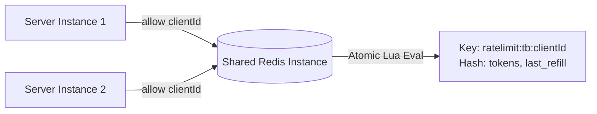

# High-Performance C++ Rate Limiter & Distributed Limiting Engine

A high-performance rate limiting system implemented in modern C++ (C++23). The project provides four in-memory rate limiting algorithms optimized for high concurrency using sharded locking, deterministic inactive client memory cleanup, an embedded HTTP API server, and a distributed Redis-backed Token Bucket using atomic server-side Lua scripts.

---

## Key Features

- **4 In-Memory Rate Limiting Algorithms**: Fixed Window, Sliding Window Log, Sliding Window Counter, and Token Bucket.
- **High-Concurrency Sharded Locking**: Map state partitioned into 64 distinct shards with independent mutexes, eliminating cross-client lock contention and scaling to over **27 million ops/sec**.
- **Distributed Redis Token Bucket**: Multi-server rate limiting backed by Redis and `hiredis`, executing an atomic Lua script with server-side `TIME` clock synchronization.
- **Deterministic Memory Cleanup**: Inactive client state expiration through opportunistic shard-level checks and explicit cleanup APIs without background thread overhead.
- **Fail-Closed Safety**: Built-in defensive handling that prevents server crashes and safely denies access if the distributed Redis backend becomes unreachable.
- **Comprehensive Benchmarking & Testing**: Rigorous unit tests, concurrency verification suites, Google Benchmark integration, and standalone latency/throughput profiling.

---

## Architecture

```mermaid
flowchart TD
    Client[Client Requests] --> Router{HTTP Server / Application}
    Router -->|In-Memory Route| ShardedLimiter[Sharded In-Memory Limiter]
    Router -->|Distributed Route| RedisLimiter[Redis Token Bucket Limiter]

    subgraph In-Memory Engine [In-Memory Engine (64 Shards)]
        ShardedLimiter --> Hash[Hash Client ID % 64]
        Hash --> Shard0[Shard 0: Mutex + Map]
        Hash --> Shard1[Shard 1: Mutex + Map]
        Hash --> Shard63[Shard 63: Mutex + Map]
    end

    subgraph Distributed Engine [Distributed Engine (Redis)]
        RedisLimiter --> RedisConn[hiredis Client Connection]
        RedisConn --> Lua[Atomic Lua Script]
        Lua --> RedisTime[Redis Server TIME]
        Lua --> RedisHash[Redis Hash: tokens, last_refill]
        Lua --> TTL[Automatic Key TTL Expiration]
    end
```

---

## Supported Algorithms

| Algorithm | Accuracy | Time Complexity | Memory Complexity | Best Use Case |
|---|---|---|---|---|
| **Fixed Window** | Low (allows boundary bursts up to $2\times$ limit) | $O(1)$ | $O(1)$ per client | Simple quotas with discrete reset intervals (e.g., hourly limits). |
| **Sliding Window Log** | 100% Exact | $O(N)$ worst-case | $O(N)$ where $N$ is request volume | Strict security APIs where boundary burst compliance must be mathematically exact. |
| **Sliding Window Counter** | High Approximation ($\pm$ weighted window) | $O(1)$ | $O(1)$ per client (~32 bytes) | High-throughput APIs requiring burst protection with minimal memory footprint. |
| **Token Bucket (In-Memory)** | High (continuous refill) | $O(1)$ | $O(1)$ per client | Handling bursts smoothly while enforcing a sustained average request rate. |
| **Redis Token Bucket** | High (distributed continuous refill) | $O(1)$ | $O(1)$ per client in Redis | Multi-instance distributed microservices sharing a unified global rate limit. |

---

## Concurrency Design

### The Problem with a Global Mutex
A standard rate limiter implementation protects a single `std::unordered_map<string, ClientState>` with a single `std::mutex`. Under multi-threaded workloads, independent clients contend for the exact same lock, degrading throughput from multi-core parallelism down to serialized execution.

### The 64-Shard Locking Architecture
To resolve lock contention:
1. State is split across **64 discrete shards** (`Shard shards[64]`).
2. Each shard owns an independent `std::mutex` and private client `std::unordered_map`.
3. Client IDs are assigned to shards using `std::hash<string>{}(clientId) % 64`.

```
Thread 1 (Client A) ──> Hash(Client A) % 64 = Shard 2  ──> Lock Mutex 2 (No Contention)
Thread 2 (Client B) ──> Hash(Client B) % 64 = Shard 15 ──> Lock Mutex 15 (No Contention)
Thread 3 (Client A) ──> Hash(Client A) % 64 = Shard 2  ──> Waits for Mutex 2 (Correctly Serialized)
```

* **Safety**: Requests from the **same client** map to the same shard and remain strictly serialized to prevent race conditions on token balances.
* **Scalability**: Requests from **different clients** distribute evenly across shards, executing concurrently without blocking each other.

---

## Client State Cleanup

In long-running production systems, inactive clients accumulate in memory over time.

1. **Activity Tracking**: Each client record maintains a `lastAccess` timestamp updated on every request.
2. **Opportunistic Shard-Level Cleanup**: During regular `allow()` calls, a shard checks if its local cleanup interval (default: 60s) has elapsed. If so, it removes stale entries exceeding the expiration threshold in that shard only.
3. **Explicit Cleanup API**: A manual `cleanup(currTime)` method iterates across shards to reclaim expired memory deterministically.
4. **No Background Thread Overhead**: Memory reclamation occurs without dedicated background worker threads, avoiding thread context-switching overhead and locking interference.

---

## Distributed Rate Limiting with Redis

Local in-memory limiters cannot share state across distinct physical server processes. The project includes a distributed Token Bucket limiter backed by Redis.



### Key Components:
- **Redis Hash State**: Stored at `ratelimit:tb:<clientId>` with fields `tokens` (floating balance) and `last_refill` (timestamp).
- **Atomic Lua Script**: The entire calculation (fetching time, computing elapsed refill, checking capacity, decrementing tokens, and setting TTL) executes in a single atomic Lua script on Redis.
- **Unified Clock Authority (`Redis TIME`)**: The Lua script calls `redis.call('TIME')` directly on the Redis server, ensuring that independent server instances never suffer from local clock drift.
- **Automatic TTL Expiration**: Every successful or denied request refreshes the key's TTL (`max(10, 2 * capacity / refillRate)`), allowing Redis to automatically evict stale keys.
- **Fail-Closed Safety**: If Redis is offline or encounters socket failures, the C++ client safely catches the error and returns a denied result (`{allowed = false, remaining = 0, retryAfter = 1}`) without crashing.

---

## Benchmarking & Results

Benchmarks were executed on a Release build (`-O3`) comparing all in-memory limiters across 8 worker threads against the Redis distributed implementation.

### Verified Final Benchmark Results

| Rate Limiter Algorithm | Backend Architecture | Total Operations | Allowed | Denied | Total Time (ms) | Throughput (ops/sec) | Avg Latency |
|---|---|---|---|---|---|---|---|
| **Sliding Window Counter** | In-Memory (64 Shards) | 2,000,000 | 2,000,000 | 0 | 72.82 ms | **27,464,597 ops/s** | **36 ns** |
| **In-Memory Token Bucket** | In-Memory (64 Shards) | 2,000,000 | 2,000,000 | 0 | 76.31 ms | **26,209,785 ops/s** | **38 ns** |
| **Fixed Window Limiter** | In-Memory (64 Shards) | 2,000,000 | 2,000,000 | 0 | 87.03 ms | **22,980,614 ops/s** | **43 ns** |
| **Sliding Window Log** | In-Memory (64 Shards) | 2,000,000 | 2,000,000 | 0 | 104.28 ms | **19,178,748 ops/s** | **52 ns** |
| **Redis Token Bucket** | Distributed (Redis + Lua) | 20,000 | 20,000 | 0 | 1566.60 ms | **12,767 ops/s** | **78,329 ns** (78 µs) |

> **Note on Comparisons**: Redis operations include complete TCP socket transport, Linux kernel context switches, protocol serialization (`hiredis`), and Redis Lua script dispatch. In-memory operations measure direct CPU cache and RAM access.

---

## Performance Takeaways

1. **Arithmetic-Based Limiters Are Fastest**: **Sliding Window Counter** and **Token Bucket** achieve over **26–27 million operations/second** with **36–38 ns average latency** due to pure $O(1)$ stack arithmetic without dynamic memory allocations.
2. **Impact of Sharded Locking**: Multi-client concurrent execution scales across CPU cores with near-zero lock contention compared to single-mutex architectures.
3. **Sliding Window Log Trade-off**: The Sliding Window Log guarantees 100% boundary accuracy but incurs queue memory allocations and deallocations, running ~30% slower than the Sliding Window Counter.
4. **Local vs. Distributed Trade-off**: In-memory limiting provides sub-microsecond latency (36 ns) for local process defense, while Redis provides global consistency across multiple server nodes at sub-millisecond latency (78 µs).

---

## Build Instructions

### Prerequisites
- **C++ Compiler**: GCC 13+ or Clang 16+ with **C++23** support
- **Build System**: CMake 3.20+
- **Threads**: POSIX Threads (`pthread`)
- **Redis Server**: Redis 6.0+ (running on `127.0.0.1:6379`)

> Dependencies (`hiredis` v1.2.0 and `google-benchmark` v1.8.3) are automatically downloaded and compiled via CMake `FetchContent`.

### Compilation (Release Mode)
```bash
# Configure the build in Release mode
cmake -S . -B build -DCMAKE_BUILD_TYPE=Release

# Build all targets in parallel
cmake --build build -j$(nproc)
```

---

## Running Tests

Ensure Redis is running locally before executing the test suite:
```bash
# Start Redis (if not already active)
redis-server --daemonize yes

# Run all test executables
./build/fixed_window_test
./build/sliding_window_test
./build/token_bucket_test
./build/sliding_window_counter_test
./build/concurrency_test
./build/concurrency_multi_client_test
./build/cleanup_test
./build/redis_token_bucket_test
```

---

## Running Benchmarks

### Standalone std::chrono Benchmark Suite
Runs the comprehensive benchmark across all 5 limiter implementations:
```bash
./build/final_benchmark
```

### Google Benchmark Suite
Runs micro-benchmarks with thread scaling and multi-client workload variations:
```bash
./build/rate_limiter_benchmark
```

Baseline Google Benchmark results are preserved at `benchmark_results/baseline/baseline.json`.

---

## Running the HTTP Server

Start the rate-limited HTTP server on port 8080:
```bash
./build/rate_limiter
```

### Test Endpoints via `curl`:
```bash
# 1. Unprotected health check
curl -i http://127.0.0.1:8080/health

# 2. Unprotected route
curl -i http://127.0.0.1:8080/unlimited

# 3. Rate-limited route (Capacity: 10, Refill: 1 req/sec)
for i in {1..12}; do curl -s -i http://127.0.0.1:8080/limited | grep -E "HTTP|X-RateLimit|Retry-After|message"; done
```

---

## Project Structure

```
rate-limiter/
├── CMakeLists.txt                      # Build configuration with FetchContent dependencies
├── README.md                           # Project documentation
├── include/                            # Public header files
│   ├── fixedWindowLimiter.h            # Fixed Window rate limiter class
│   ├── slidingWindowLimiter.h          # Sliding Window Log limiter class
│   ├── slidingWindowCounterLimiter.h   # Sliding Window Counter limiter class
│   ├── tokenBucketLimiter.h            # In-memory Token Bucket limiter class
│   ├── redisTokenBucketLimiter.h       # Distributed Redis Token Bucket class
│   ├── rateLimitResult.h               # Result struct (allowed, remaining, retryAfter)
│   └── httpServer.h                    # HTTP server wrapper
├── src/                                # Implementation files
│   ├── fixedWindowLimiter.cpp
│   ├── slidingWindowLimiter.cpp
│   ├── slidingWindowCounterLimiter.cpp
│   ├── tokenBucketLimiter.cpp
│   ├── redisTokenBucketLimiter.cpp
│   ├── httpServer.cpp
│   └── main.cpp                        # HTTP service entry point
├── tests/                              # Unit and concurrency test suites
│   ├── fixedWindowLimiterTest.cpp
│   ├── slidingWindowLimiterTest.cpp
│   ├── slidingWindowCounterLimiterTest.cpp
│   ├── tokenBucketLimiterTest.cpp
│   ├── concurrencyTest.cpp
│   ├── concurrencyMultiClientTest.cpp
│   ├── cleanupTest.cpp
│   └── redisTokenBucketLimiterTest.cpp
├── benchmarks/                         # Benchmark infrastructure
│   ├── rate_limiter_benchmark.cpp      # Google Benchmark implementation
│   └── final_benchmark.cpp             # Standalone chrono benchmark suite
└── benchmark_results/                  # Benchmark artifacts
    └── baseline/
        └── baseline.json               # Recorded baseline metrics
```

---

## Limitations

- **Fixed Shard Count**: Sharding is fixed at compile-time to 64 shards, which is optimal for common CPU core counts but does not dynamically scale with core topology.
- **Single Redis Node**: The Redis-backed limiter targets a standalone Redis instance; Redis Cluster, Sentinel, and automatic failover replication are not implemented.
- **Single Connection Per Limiter**: The Redis client maintains a single synchronous `redisContext` connection without connection pooling.
- **Fail-Closed Strategy**: When Redis is unreachable, the system denies requests by default to protect downstream services, which may not suit availability-first systems.
- **Hardware-Dependent Numbers**: Absolute throughput and latency metrics vary based on CPU architecture, memory bandwidth, and operating system socket stack performance.