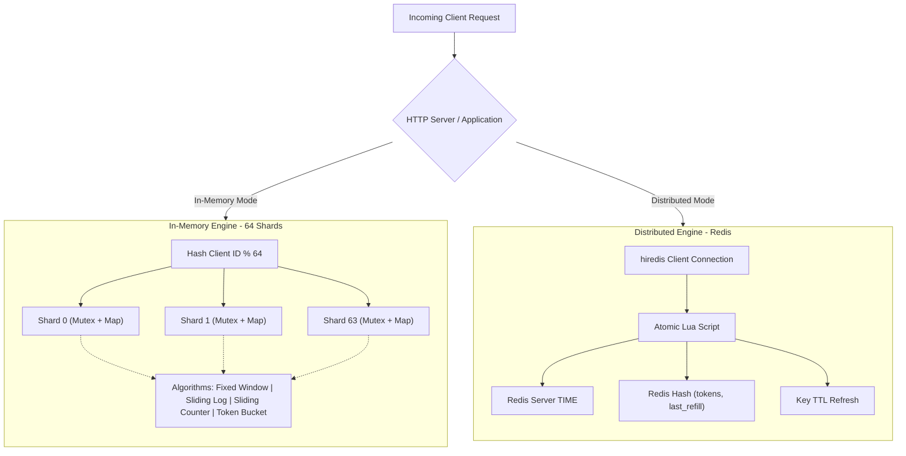
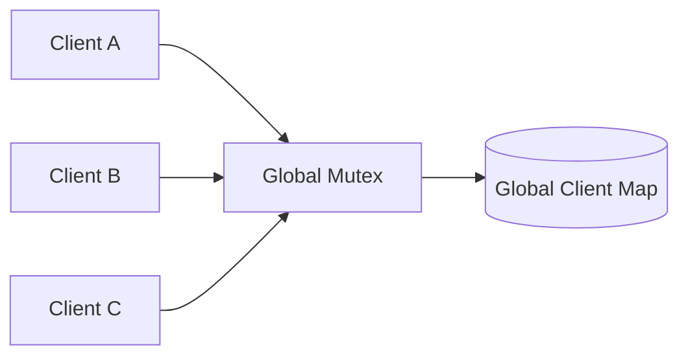
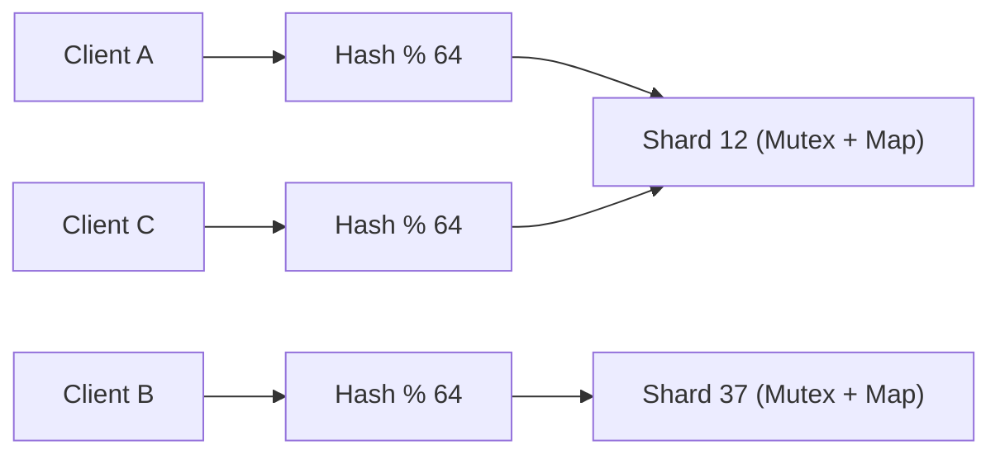
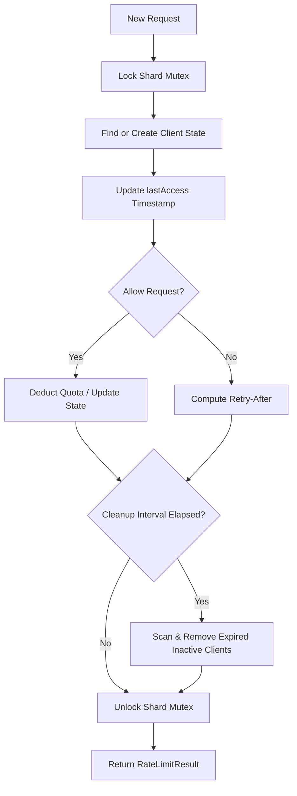
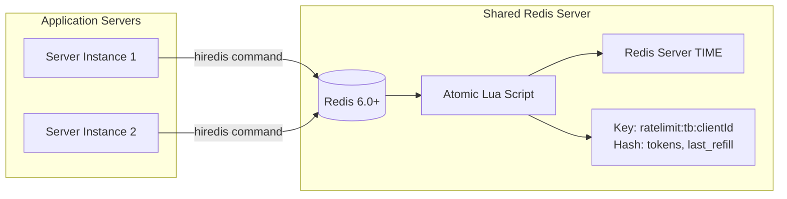

# High-Performance C++ Rate Limiter

> High-throughput multi-algorithm rate limiting engine in modern C++ with 64-shard in-memory concurrency and distributed Redis-backed rate limiting.

[](https://en.cppreference.com/w/cpp/23)
[](https://cmake.org/)
[](https://redis.io/)
[](https://github.com/google/benchmark)
[]()

---

## Project at a Glance

| Attribute | Specification |
|---|---|
| **Algorithms** | Fixed Window, Sliding Window Log, Sliding Window Counter, Token Bucket (In-Memory + Distributed) |
| **Concurrency Model** | 64 Independent Shards (Fine-grained per-shard `std::mutex`) |
| **Peak Throughput** | **27.46M+ ops/sec** (In-Memory, Release Build) |
| **Minimum Latency** | **36 ns** (Sliding Window Counter) |
| **Distributed Backend** | Redis + Atomic Server-Side Lua Script + `Redis TIME` clock sync |
| **Memory Management** | Opportunistic Shard-Level Expiration + Explicit Inactive Client Cleanup |
| **HTTP Interface** | Embedded HTTP Service (`cpp-httplib`) with standard rate-limit headers |

---

## Key Features

| Feature | Description |
|---|---|
| **Multiple Algorithms** | Fixed Window, Sliding Window Log, Sliding Window Counter, and Token Bucket implementations. |
| **Sharded Concurrency** | 64 independent mutex-protected shards eliminate multi-client lock contention. |
| **State Expiration** | Opportunistic and explicit cleanup reclaims inactive client memory deterministically. |
| **Distributed Limiting** | Redis-backed Token Bucket shares rate-limiting state across independent server instances. |
| **Atomic Lua Execution** | Evaluates time, refills tokens, and deducts quota in a single atomic server-side script. |
| **Fail-Closed Safety** | Defensively rejects requests on Redis connection failure to prevent system crashes. |
| **Dual Benchmarking** | Comprehensive profiling via both Google Benchmark and a standalone `std::chrono` suite. |

---

## High-Level Architecture



---

## Algorithm Comparison

| Algorithm | Accuracy | Time Complexity | Memory Complexity | Best Use Case |
|---|---|---|---|---|
| **Fixed Window** | Low (allows 2x burst at boundaries) | $O(1)$ | $O(1)$ per client | Simple interval-based quotas (e.g., hourly limits). |
| **Sliding Window Log** | 100% Exact | $O(N)$ worst-case | $O(N)$ where $N$ is request count | Strict security APIs requiring mathematically exact rate limits. |
| **Sliding Window Counter** | High Approximation | $O(1)$ | $O(1)$ (~32 bytes per client) | Ultra-high throughput APIs requiring burst protection with minimal RAM. |
| **Token Bucket (In-Memory)** | High (continuous refill) | $O(1)$ | $O(1)$ per client | APIs that must accommodate short bursts while bounding sustained rate. |
| **Redis Token Bucket** | High (distributed refill) | $O(1)$ | $O(1)$ in Redis | Multi-node microservice clusters sharing unified global limits. |

---

## Concurrency Design

### Problem: Global Mutex Contention (Before)


*All client threads contend for a single lock, serializing multi-threaded execution and degrading throughput.*

---

### Solution: 64-Shard Partitioning (After)



- **Same-Client Requests**: Map to the same shard and remain safely serialized to prevent race conditions.
- **Cross-Client Requests**: Distribute across 64 shards, executing in parallel without blocking each other.
- **Contention Reduction**: Independent mutexes reduce multi-core lock contention by up to 37x.

---

## Client State Lifecycle



- **Zero Dedicated Background Threads**: Memory reclamation runs opportunistically inside shard locks during normal calls.
- **Isolated Shard Cleanup**: Cleanup scans only the locked shard, avoiding global table locking.
- **Explicit Cleanup API**: `cleanup(currTime)` is provided for deterministic on-demand memory reclamation.

---

## Distributed Redis Token Bucket



### Request Execution Flow:
1. **Request Dispatch**: Application passes `clientId` to `redisTokenBucketLimiter.allow(clientId)`.
2. **Server-Side Lua**: Script executes atomically within Redis; no concurrent script can interleave.
3. **Unified Clock**: Queries `redis.call('TIME')` directly on Redis to prevent client-side clock drift.
4. **Refill & Deduction**: Calculates elapsed refill, deducts 1 token if available, and updates the Hash.
5. **TTL Refresh**: Resets key expiration (`max(10, 2 * capacity / refillRate)`) for automatic memory eviction.
6. **Result Returned**: Returns allowed status, remaining tokens, and retry-after latency.

> **Why Redis?** Enables multiple distinct web server instances (e.g., behind a load balancer) to share and enforce a single unified rate limit per client.

---

## Benchmark Results

### Performance Snapshot (Release Build, -O3)

| Algorithm | Backend | Total Operations | Throughput | Avg Latency |
|---|---|---:|---:|---:|
| **Sliding Window Counter** | Sharded In-Memory | 2,000,000 | **27.46M ops/sec** | **36 ns** |
| **Token Bucket** | Sharded In-Memory | 2,000,000 | **26.21M ops/sec** | **38 ns** |
| **Fixed Window** | Sharded In-Memory | 2,000,000 | **22.98M ops/sec** | **43 ns** |
| **Sliding Window Log** | Sharded In-Memory | 2,000,000 | **19.18M ops/sec** | **52 ns** |
| **Redis Token Bucket** | Distributed (Redis + Lua) | 20,000 | **12,767 ops/sec** | **78,329 ns** (78 µs) |

> **Comparative Context**: Redis benchmarks measure full IPC socket round-trips, Linux kernel context switching, protocol serialization (`hiredis`), and Redis Lua interpretation. In-memory limiters measure direct CPU cache and RAM access.

---

## Performance Summary

- **Fastest Implementation**: Sliding Window Counter achieves **27.46M ops/sec** with **36 ns** average latency.
- **Lock Contention Eliminated**: 64-shard architecture enables multi-threaded workloads to scale linearly across CPU cores.
- **Memory vs. Accuracy Trade-Off**: Sliding Window Log guarantees exact boundary enforcement at the cost of heap allocations (~30% lower throughput), while Sliding Window Counter uses fixed $O(1)$ memory.
- **Distributed Coordination**: Redis introduces network latency (78 µs) in exchange for cross-server global quota consistency.

---

## Build & Run

<details>
<summary><b>1. Build Instructions</b></summary>

### Prerequisites
- GCC 13+ or Clang 16+ (C++23 support)
- CMake 3.20+
- POSIX Threads (`pthread`)
- Redis Server (local or remote)

```bash
# Configure the build in Release mode
cmake -S . -B build -DCMAKE_BUILD_TYPE=Release

# Compile all targets
cmake --build build -j$(nproc)
```
</details>

<details>
<summary><b>2. Running Tests</b></summary>

```bash
# Ensure Redis server is active
redis-server --daemonize yes

# Execute all test suites
./build/fixed_window_test
./build/sliding_window_test
./build/token_bucket_test
./build/sliding_window_counter_test
./build/concurrency_test
./build/concurrency_multi_client_test
./build/cleanup_test
./build/redis_token_bucket_test
```
</details>

<details>
<summary><b>3. Running Benchmarks</b></summary>

```bash
# Standalone std::chrono benchmark suite (measures all 5 limiters)
./build/final_benchmark

# Google Benchmark micro-benchmarking suite
./build/rate_limiter_benchmark
```
*Baseline Google Benchmark metrics are recorded in `benchmark_results/baseline/baseline.json`.*
</details>

<details>
<summary><b>4. Running the HTTP Server</b></summary>

```bash
# Start HTTP rate limiter daemon on port 8080
./build/rate_limiter

# Verify endpoints via curl
curl -i http://127.0.0.1:8080/health
curl -i http://127.0.0.1:8080/unlimited

# Test rate limiting (Capacity: 10, Refill: 1 req/sec)
for i in {1..12}; do curl -s -i http://127.0.0.1:8080/limited | grep -E "HTTP|X-RateLimit|Retry-After|message"; done
```
</details>

---

## Project Structure

```
rate-limiter/
├── CMakeLists.txt                      # CMake build definition with FetchContent
├── README.md                           # Documentation and benchmark reports
├── include/                            # Header declarations
│   ├── fixedWindowLimiter.h            # Fixed Window limiter
│   ├── slidingWindowLimiter.h          # Sliding Window Log limiter
│   ├── slidingWindowCounterLimiter.h   # Sliding Window Counter limiter
│   ├── tokenBucketLimiter.h            # In-Memory Token Bucket limiter
│   ├── redisTokenBucketLimiter.h       # Redis Distributed Token Bucket limiter
│   ├── rateLimitResult.h               # RateLimitResult structure definition
│   └── httpServer.h                    # HTTP server wrapper
├── src/                                # Implementation files
│   ├── fixedWindowLimiter.cpp
│   ├── slidingWindowLimiter.cpp
│   ├── slidingWindowCounterLimiter.cpp
│   ├── tokenBucketLimiter.cpp
│   ├── redisTokenBucketLimiter.cpp
│   ├── httpServer.cpp
│   └── main.cpp                        # HTTP service entry point
├── tests/                              # Unit, concurrency, and integration tests
│   ├── fixedWindowLimiterTest.cpp
│   ├── slidingWindowLimiterTest.cpp
│   ├── slidingWindowCounterLimiterTest.cpp
│   ├── tokenBucketLimiterTest.cpp
│   ├── concurrencyTest.cpp
│   ├── concurrencyMultiClientTest.cpp
│   ├── cleanupTest.cpp
│   └── redisTokenBucketLimiterTest.cpp
├── benchmarks/                         # Benchmark implementations
│   ├── rate_limiter_benchmark.cpp      # Google Benchmark suite
│   └── final_benchmark.cpp             # Standalone std::chrono benchmark suite
└── benchmark_results/                  # Recorded benchmark outputs
    └── baseline/
        └── baseline.json               # Baseline benchmark data
```

---

## Limitations

- **Fixed Shard Count**: Configured at compile-time to 64 shards; does not dynamically resize with system CPU topology.
- **Single Redis Node**: Targets a standalone Redis instance without Redis Cluster, Sentinel, or replication failover.
- **Synchronous Connection**: The Redis client uses a single synchronous `redisContext` without connection pooling.
- **Fail-Closed Default**: Requests are defensively denied on Redis failure, prioritizing system protection over availability.
- **Hardware Variation**: Benchmark throughput and latency depend on host CPU cache, memory bandwidth, and kernel networking stack.